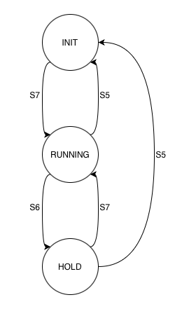

# Beschreibung

## Aufgabenbeschreibung

In diesem Programm wird eine Stoppuhr implementiert. Diese wird mit einem Zustandsautomaten modelliert. Sie hat drei Zustände `INIT`, `RUNNING`und `HOLD`. Diese werden im Folgenden detaillierter beschrieben. Die Stoppuhr startet im Zustand `INIT`. Die Zustände werden durch das Drücken der Tasten `S5`, `S6`und `S7`gewechselt. Die angezeigte Zeit wird in dem Format `MINUTEN:SEKUNDEN:MILLISEKUNDEN` ausgegeben.

## Zustände

Hier wird die bedeutung der Zustände des Automaten näher erklärt.

### INIT
Die Stoppuhr befindet sich im Ausgangszustand. Auf dem Display wird die Zeit `00:00:00`angezeigt.

**Zustandswechsel:**
- `S7`: Der Automat wechselt in den Zustand `RUNNING`.

### RUNNING
Die Stoppuhr wird gestartet. Auf dem Display wird die seit dem Zustandswechsel vergangene Zeit angezeigt.

**Zustandswechsel:**
- `S5`: Der Automat wechselt in den Zustand `INIT`.
- `S6`: Der Automat wechselt in den Zustand `HOLD`.

### HOLD
Die Stoppuhr läuft weiter. Auf dem Display wird bisher gestoppte Zeit angezeigt.

**Zustandswechsel:**
- `S5`: Der Automat wechselt in den Zustand `INIT`.
- `S7`: Der Automat wechselt in den Zustand `RUNNING`.

## Tastenbelegungen

### S5
Nach dem drücken der Taste `S5`wird sichergestellt, dass sich der Automat im Zustand `INIT` befindet, egal in welchem Zustand sich der Automat aktuell befindet.

### S6
Nach dem drücken der Taste `S6`wechselt der Automat in den Zustand `HOLD`, wenn er sich vorher in dem Zustand `RUNNING`befunden hat.

### S7
Nach dem drücken der Taste `S7`wird sichergestellt, dass sich der Automat im Zustand `RUNNING` befindet, egal in welchem Zustand sich der Automat aktuell befindet.

# Zeitplan

Im folgenden werden die Ziele und die bereits erledigten Teilaufgaben beschrieben.

## Siebter Praktikumstermin

### Ziele
1. Durcharbeiten der `main.s`und organisieren des bisherigen Quellcodes.
2. Erstellen von Unterprogrammen zum Ansteuern der LEDs, Abfragen der Taster und Ansteuern des Displays.

### Erledigt
Wir haben den bisherigen Quellcode aufgeräumt und durch passende Unterprogramme ersetzt. Nun existieren die Unterprogramme `readButtons`, `switchLEDsOff`und `switchLEDsOn`. Wir haben kein Unterprogramm zum Ansteuern des Displays implementiert, da es bereits das Unterprogramm `lcdPrintS`gibt. Außerdem haben wir Platzhalter für die Unterprogramme, der Zustände, des Automaten angelegt.

## Achter Praktikumstermin

### Ziele
1. Entwicklung des lauffähigen Codes für die Zustände des Automaten.
2. Fertige Implementation für die Zeitmessung.
3. Anlegen von Variablen zum speichern und ausgeben der Zeit, auf dem Display.

## Neunter Praktikumstermin

### Ziele
1. Fertigstellung der Stoppuhr.

# Technische Implementation

## Unterprogramme

Hier werden die Schnittstellen und Funktionalität, der von uns implementieren Unterprogramme erläutert.

### `readButtons`
Das Unterprogramm ließt den aktuellen Zustand der Taster aus.

**Rückgabewerte:**
- `r0`: Bitmaske der gedrückten Taster.

### `switchLEDsOff`
Das Unterprogramm schaltet die LEDs aus, die in der Bitmaske ausgewählt sind.

**Übergabeparameter:**
- `r0`: Bitmaske der LEDs, welche ausgeschaltet werden.

### `switchLEDsOn`
Das Unterprogramm schaltet die LEDs an, die in der Bitmaske ausgewählt sind.

**Übergabeparameter:**
- `r0`: Bitmaske der LEDs, welche angeschaltet werden.